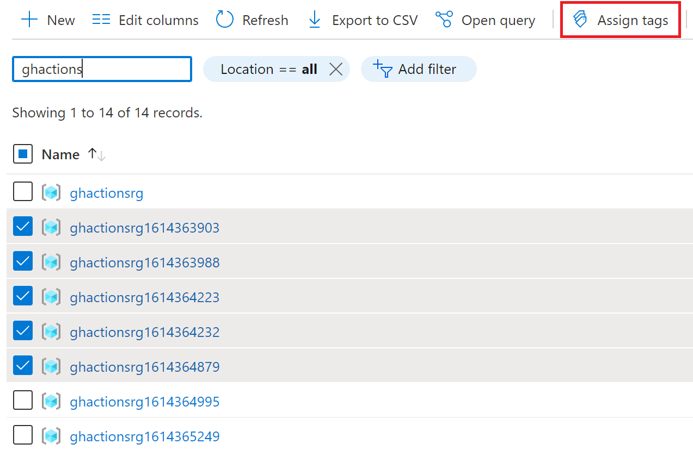
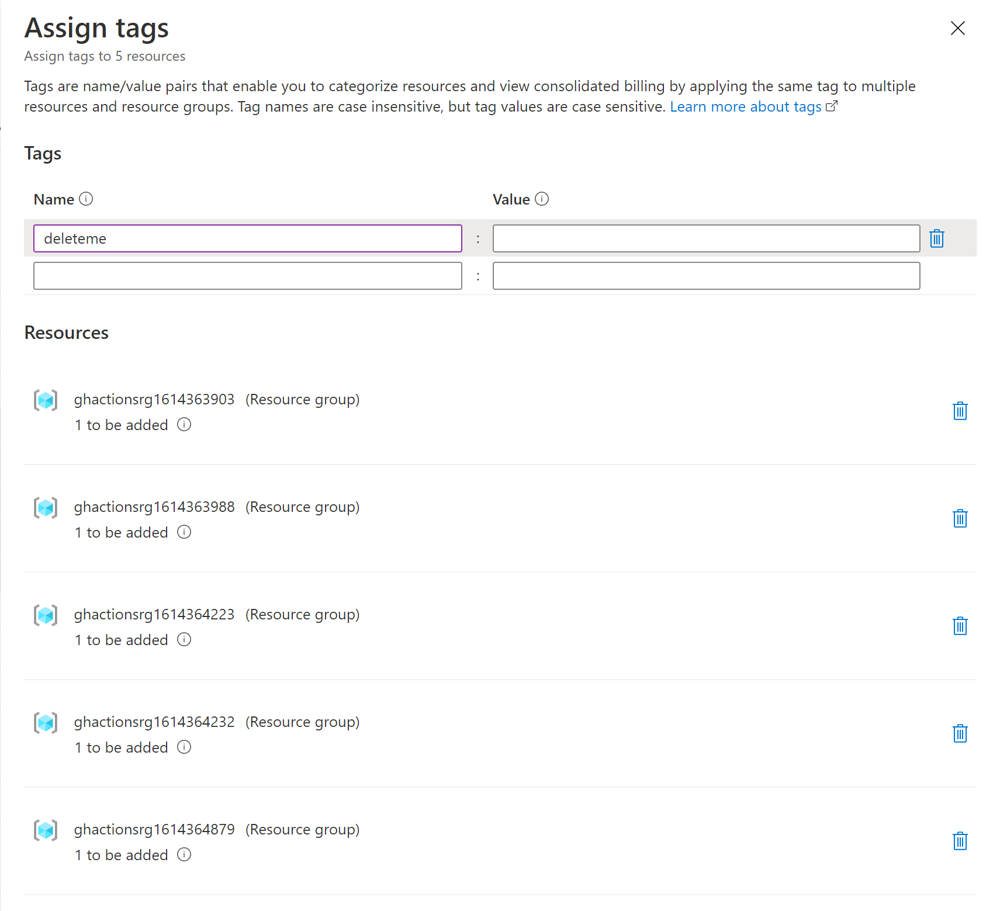
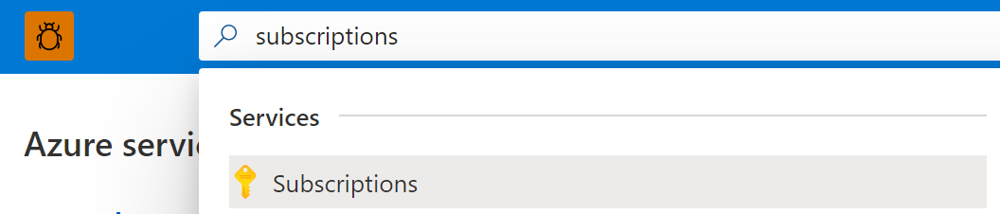
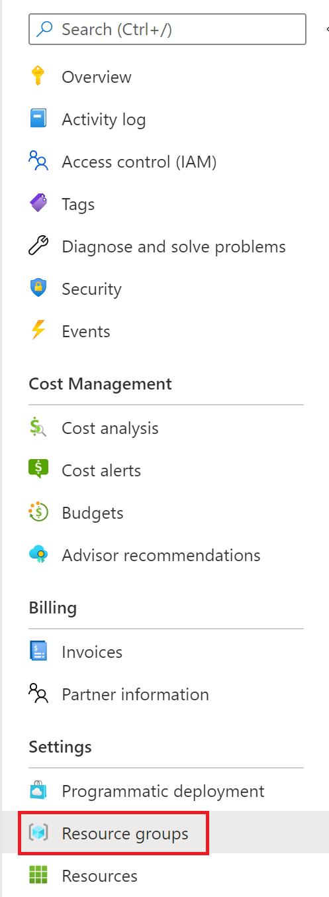

# delete-rgs-by-tag

Just one way to bulk delete Azure resource groups from an Azure subscription.

## Why

As of this writing (20210304) there's no way to bulk delete resource groups from the Azure Portal. While there's certainly valid reasons for that, bulk deletion could be helpful when you're hacking your way through some tutorial or trying something new and you've created resources that you no longer need.

## What you need

- An Azure Subscription
- An Azure resource group or two or seven
- Access to the Azure Portal: <https://portal.azure.com>
- Azure CLI: <https://docs.microsoft.com/en-us/cli/azure/install-azure-cli/>

## How

### Assign Tags in the Azure Portal

1. If you know your subscription ID, substitute `{YOUR_SUBSCRIPTION_ID}` in this URL and open it in a browser:

    (If you don't, that's cool too, see [Finding resource groups in the Azure Portal](#Finding-resource-groups-in-the-Azure-Portal) for more guidance.)

    ```plaintext
    https://ms.portal.azure.com/#@microsoft.onmicrosoft.com/resource/subscriptions/{YOUR_SUBSCRIPTION_ID/resourceGroups
    ```

1. Select the resource groups to delete with the checkboxes left of their name and select `Assign Tags`:

    

1. Specify a name for the tag and select `Save`:

    

### Execute the script

1. From this repo, make the script executable with `chmod` and login to Azure CLI:

    ```shell
    chmod u+x ./delete_rgs_by_tag.sh
    az login
    ```

1. Then, execute the script to delete all resource groups matching a tag name.

    ```shell
    ./delete_rgs_by_tag.sh deleteme
    ```

    Some things to keep in mind:

    - By default, the script will prompt your confirmation to delete each resource group

    - By default, the script will wait for deletion to complete (including deleting all the resources in the resource group) and this could take minutes

    Approving every deletion isn't necessary? Don't need to wait for confirmation that deletion of all resources in the resource group?

    Check out the [Optional Parameters](#Optional-Parameters).

    Or, at your own risk, see [High Speed Mode](#High-Speed-Mode).

## Optional Parameters

Don't want to approve every deletion?

- Auto-approve deletion of every resource group matching the tag by passing 'y' as a second argument:

    ```shell
    ./create_keyvault deleteme y
    ```

Don't want to wait for all the resources in your resource group to be deleted?

- Send the delete operations without waiting for results by passing 'n' as a third argument:

    ```shell
    ./create_keyvault deleteme n n
    ```

All the paramters in this script:

```shell
./delete_rgs_by_tag.sh: Delete all resource groups given a tag
usage: ./delete_rgs_by_tag.sh <tag> <auto approve (y/n)> <wait for completion (y/n)>
example: ./delete_rgs_by_tag.sh deleteme
```

## High Speed Mode

Whatever, I don't need confirmation at all, just delete the resource groups. You can do that:

```shell
./create_keyvault deleteme y n
```

## Helpful Things

### Finding resource groups in the Azure Portal

1. Open a browser and navigate to the Azure Portal <https://portal.azure.com/>

1. Navigate to the Subscriptions page by using the search bar:

    

1. Select your subscription from the list

1. Navigate to the Resource Groups blade:

    

### .devcontainer

I like Visual Studio Code's Remote - Containers extension because I don't have to worry about what tools are available on my machine.

Instead, when I clone the repo, I get with it all the tools the authors used to create the repo.

For more information see <https://code.visualstudio.com/docs/remote/containers/>

In their words:

> The Visual Studio Code Remote - Containers extension lets you use a Docker container as a full-featured development environment. It allows you to open any folder or repository inside a container and take advantage of Visual Studio Code's full feature set. A devcontainer.json file in your project tells VS Code how to access (or create) a development container with a well-defined tool and runtime stack. This container can be used to run an application or to sandbox tools, libraries, or runtimes needed for working with a codebase.